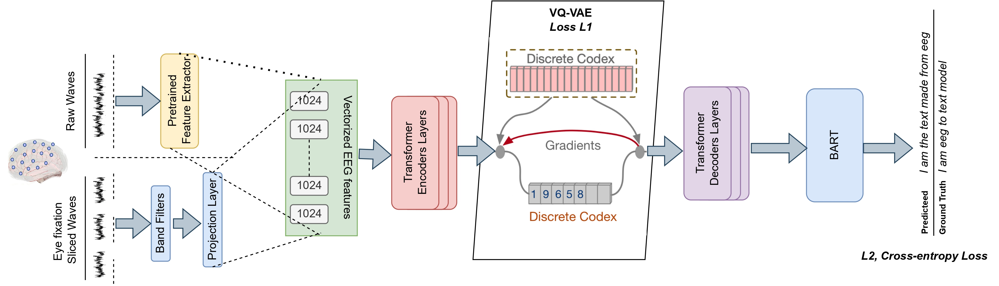

# EEG2Text: MindSync

Welcome to EEG2Text, where we introduce MindSync, a cutting-edge model for EEG-to-text translation. This repository houses the model checkpoints, datasets, experiment logs, and other resources related to MindSync.

## Model Checkpoints & Datasets

You can find the pre-trained model checkpoints and datasets on Weights & Biases (wandb) platform. Visit the following link to access them: [MindSync Checkpoints & Datasets](https://wandb.ai/b20241/ben10?nw=nwuserb20241).

## Drive Link for EEG Encoder Checkpoint

For the EEG_encoder checkpoint, please visit the following Google Drive link: [EEG Encoder Checkpoint](https://drive.google.com/drive/folders/1qffYC_34ckuyb5ht9JkuDT4MAjgPxPwh?usp=drive_link).

## Conclusion and Future Work

In our paper, we present MindSync, a pioneering model for EEG-to-text translation. MindSync excels in open vocabulary EEG-to-text sequence decoding and EEG-based sentence sentiment classification, achieving remarkable scalability and outperforming existing models. With a notable BLEU-1 score of 30, MindSync sets a new standard in EEG translation.

Looking forward, our future work aims to gather larger-scale EEG-text datasets and extend the framework to multilingual settings. We plan to apply MindSync to decode inner speech and explore neural-feedback mechanisms to enhance scientific value.

## Limitations

Despite its advancements, MindSync's accuracy in real-life scenarios still falls short compared to traditional language translations. Additionally, our experiments are limited to publicly available neural reading data, which may not fully represent "silent speech" and direct thought translation.

---